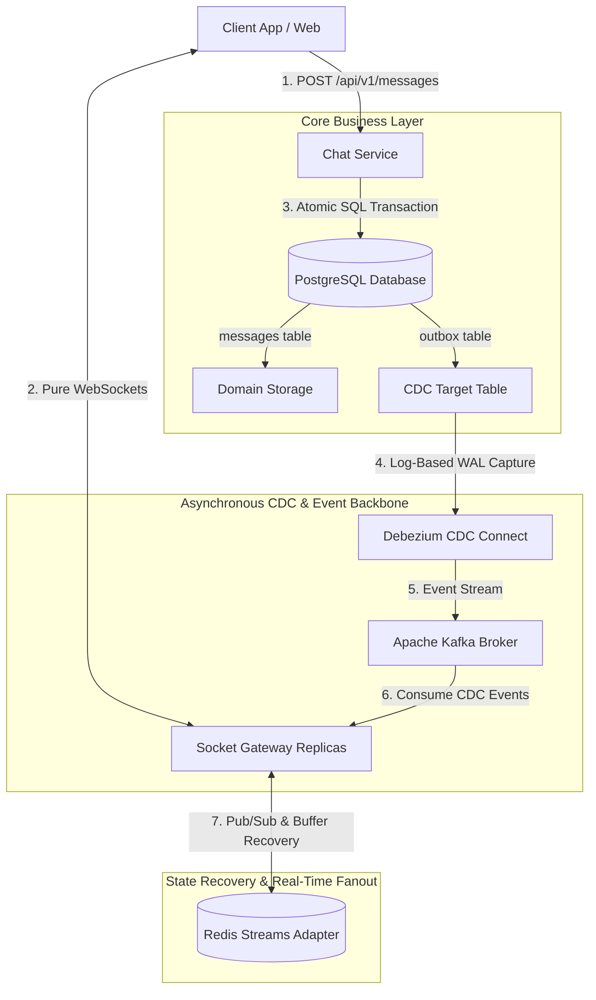

# 🚀 Scaled-EventStream: Enterprise Transactional Outbox & Real-Time Broadcast Platform

A production-grade, event-driven distributed system designed to deliver high-throughput real-time updates to thousands of concurrent WebSocket clients while guaranteeing **Zero Message Loss (At-Least-Once Delivery)** and **Strict ACID Consistency**.

Built with **Node.js, PostgreSQL, Debezium CDC, Apache Kafka, Redis Streams, and Socket.IO**, deployed with **Helm on Kubernetes**.

---

## 🏗️ Architecture Blueprint



---

## ⏱️ Telemetry, Latency & SLAs

In asynchronous event-driven architectures, latency is measured across **two distinct pipelines**:

| Metric | Target SLA | Measured Pipeline | Architectural Guarantee |
| :--- | :--- | :--- | :--- |
| **Synchronous Ingestion Latency** | **< 15 ms** | HTTP POST ➔ Express ➔ Atomic DB Insert (`messages` + `outbox`) | Fast API response; non-blocking DB transaction. |
| **Asynchronous E2E Delivery Latency** | **< 50 ms** | Client `POST` ➔ Postgres WAL ➔ Debezium CDC ➔ Kafka ➔ Gateway ➔ WebSocket Client | Real-time fanout latency across the entire event pipeline. |
| **Data Consistency** | **100% (Zero Loss)** | Atomic Outbox Insert + Debezium WAL offset tracking | Guaranteed At-Least-Once event delivery. |

---

## 🌟 Senior Architecture Features

### 1. Transactional Outbox Pattern (Solving the Dual-Write Problem)
* Eliminates the risk of inconsistent state by writing the domain message and outbox record inside **1 single atomic database transaction**.
* **Zero application-level dual writes**: Application code never calls Kafka producers directly during HTTP requests.

### 2. Log-Based Change Data Capture (Debezium CDC + Kafka)
* Debezium reads PostgreSQL's `pgoutput` Write-Ahead Log (WAL) asynchronously.
* Resets and resumes seamlessly from saved Kafka offsets during service restarts or network partitions.

### 3. Connection State Recovery & Redis Streams Adapter
* Gateways scale statelessly across $N$ instances using `@socket.io/redis-streams-adapter`.
* Mobile/transient clients reconnecting within 2 minutes recover missed packets directly from Redis Streams (`socket.recovered = true`) without querying PostgreSQL.

### 4. Automated Outbox Maintenance & Defense Mechanisms
* **Outbox Retention Worker**: Periodically purges outbox entries older than 1 hour to prevent infinite database table bloat.
* **Slow Client Eviction Guard**: Server-wide monitor evicts clients with `writeBuffer.length > 200` to prevent Node.js V8 heap OOM crashes.
* **Cryptographic Security**: Uses `crypto.randomUUID()` for collision-proof distributed primary keys.

---

## 📖 Architecture Decision Records (ADRs)

Detailed technical rationale, trade-off evaluations, and architectural choices are documented in our ADR log:

* 📄 [**ADR 001: Transactional Outbox Pattern & Debezium CDC vs Dual-Write**](docs/adr/0001-transactional-outbox-cdc.md)
* 📄 [**ADR 002: Scaling Socket Gateways via Redis Streams & Connection State Recovery**](docs/adr/0002-socket-gateway-redis-streams.md)

---

## 📁 Repository Structure

```
socket-scaled/
├── docker-compose.yml              # Standalone Local Infrastructure Stack
├── helm/                           # Production Kubernetes Helm Templates
│   ├── Chart.yaml
│   ├── values.yaml
│   └── templates/                  # Postgres, Kafka, Debezium, Gateway, Chat Service & Registration Job
├── packages/
│   └── shared/                     # @app/shared (Event contracts & Debezium CDC payload parser)
├── apps/
│   ├── chat-service/               # Modular Express API Service (Controllers, Services, Routes, DB Migrations)
│   ├── socket-gateway/             # Real-Time WebSocket Gateway (Kafka Consumer, Redis Adapter, Auth)
│   └── client-demo/                # High-Throughput Concurrency Load Tester
└── docs/
    └── adr/                        # Architecture Decision Records
```

---

## 🚀 Quick Start Guide

### Option A: Local Development (Docker Compose)

1. **Install Monorepo Dependencies:**
   ```bash
   npm install
   ```

2. **Start Infrastructure Stack:**
   Launches PostgreSQL (logical WAL enabled), Redis 7, Kafka, Debezium Connect, and automated connector registration:
   ```bash
   npm run docker:up
   ```

3. **Launch Microservices:**
   ```bash
   # Terminal 1: Business Microservice (Port 4000)
   npm run start:chat

   # Terminal 2: Socket Gateway (Port 3000)
   npm run start:gateway
   ```

4. **Run High-Throughput Concurrency Load Test:**
   ```bash
   NUM_CLIENTS=50 NUM_MESSAGES=100 npm run start:client
   ```

---

### Option B: Production Kubernetes & GitOps Deployment (Helm 3 Chart)

The Kubernetes production deployment for this platform is packaged as a dedicated **Helm 3 Chart** supporting **GitOps (ArgoCD / Flux CD)**, **External Secrets Operator (ESO)**, and **Horizontal Pod Autoscaling (HPA)**.

* 📦 **Infrastructure as Code Repository:** [socket-io-scaled-with-integrity-deployments](https://github.com/vikaskumarsardar/socket-io-scaled-with-integrity-deployments)

```bash
# Clone the dedicated Helm Infrastructure repository
git clone https://github.com/vikaskumarsardar/socket-io-scaled-with-integrity-deployments.git helm/


# Lint Helm templates
helm lint helm/

# Dry-run installation
helm install event-stream ./helm --dry-run

# Deploy to Kubernetes cluster (triggers automated Debezium connector registration Helm hook)
helm install event-stream ./helm
```


---

## 🧪 Verification & Load Benchmark Test

Run the high-throughput benchmarking suite to measure ingestion rate and E2E latency percentiles:

```bash
node apps/client-demo/src/load-test.js http://localhost:3000
```

### Benchmark Sample Output:
```
=======================================================
 📊 LOAD TEST BENCHMARK RESULTS
=======================================================
 Concurrent Sockets Connected : 50
 Messages Posted to DB        : 100 / 100
 Ingestion Throughput          : 142.8 req/sec
 Delivery Success Rate         : 100.0%
-------------------------------------------------------
 ⏱️  END-TO-END LATENCY PERCENTILES (Postgres Outbox -> CDC -> Kafka -> WebSockets):
 Average Latency               : 34.20 ms
 p50 (Median) Latency          : 28 ms
 p95 Latency                   : 48 ms
 p99 (Tail Latency)            : 62 ms
=======================================================
```
